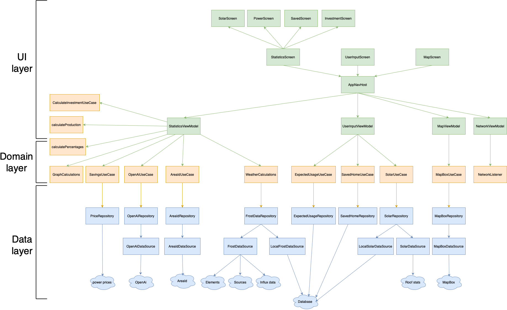

# Architecture
### Intro
Dette dokumentet er tiltenkt utviklere som skal sette seg inn i, videreutvikle og vedlikeholde CellMate. Det gir en oversikt over arkitekturen, designprinsipper og teknologier som er brukt. Dokumentet skal bidra til at videre arbeid skjer i tråd med etablert praksis og kodestil.
### Overordnet arkitektur
- Kodebasen for prosjektet er delt opp i tre hoveddeler:
	- `/data`
		- Datalaget inneholder alle endepunkter, `/remote` med alle API-er, som også deler en felles `client provider` som er lagt opp som en singelton for å effektivisere ressursbruk. Lokal lagring ved bruk av `Room database`. Alt av repository implementasjoner i `/repositoryImpl`, der hvert repository har et tilhørende interface i domenelaget for å gjøre det enklere dersom gamle implementasjoner skal erstattes eller nye API-er skal legges til.
	- `/domain`
		- Domenelaget holder på tre ting. Datamodeller i `/model`, repository interface i `/repository`, og beregninger/forretningslogikk i `/usecase`. Domenelaget bidrar til høy kohesjon og gjør koden enklere å vedlikeholde og utvide.
	- `/ui`
		- Inneholder alt knyttet til brukergrensesnittet. Skjermer, komponenter og ViewModels er organisert i egne pakker. ViewModellene henter data og logikk fra domenelaget.
- Videre utvikling med denne arkitekturen er fullt mulig. Det er lurt å holde klasser og funksjoner korte og fokusert på én oppgave for å bevare høy kohesjon. Koblingen mellom ViewModel og domenelaget er i dag noe tett, og det kan være nyttig å refaktorere eller innføre en bedre praksis for å redusere avhengigheten her.

### Objektorienterte prinsipper
CellMate bygger på prinsipper som gjør koden mere robust, testbar og bedre å videreutvikle.
- MVVM (Model-View-ViewModel)
	- Vi bruker MVVM for å separere ui logikk fra forretningslogikk. View/UI viser kun data og sender videre brukerhandlinger. ViewModel oppdaterer tilstander basert på brukerhandling. Model/forretningslogikken henter data og behandler den for ViewModellene. 
- Lav kobling
	- Nesten hele kodebasen er begrenset slik at deler av systemet kun kjenner til det den trenger. UI-laget kjenner ikke til hvordan dataen hentes, bare at den får det fra ViewModel. Datalaget vet ikke hvordan dataen brukes, bare at det sendes videre opp i koden. Et område som er litt tett er mellom UI-laget og domenelaget.
- Høy kohesjon
	- Alle de ulike modulene i prosjektet har klart definerte oppgaver. `UI` presenterer data for bruker, `domene` håndterer forretningslogikk og `data` håndterer dataen. Dette er enkelt, oversiktlig og greit å utvide fra.
- UDF (Unidirectional Data Flow)
	- Designmønsteret UDF opprettholdes av vår prioritering av lav kobling mellom komponenter i systemet. Med tydelige skilte lag (`/ui`, `/domain` og `/data`) flyter data i en retning.
### Våres løsning
- Underveis i utviklingen har vi lagt til flere teknologier etter behov. Når vi har støtt på strukturelle problemer, har vi valgt å omstrukturere prosjektet med en gang heller enn å fortsette med midlertidige løsninger. For eksempel innførte vi et domenelag da vi så at forretningslogikk i datalaget og ViewModels førte til lav kohesjon. Vi tok også i bruk Dagger Hilt for å rydde opp i en uoversiktlig implementasjon av dependency injection. Slike endringer oppfordres til å gjøre tidlig, da kostnaden ved å utsette dem øker eksponensielt over tid.
### Tech stack
- `Kotlin` - språk brukt
- `Jetpack Compose` - UI-rammeverk brukt for å lage brukergrensesnitt
- `Kotlin Coroutines` - Håndtere API-kall og databaseoperasjoner asynkront og effektivt
- `Ktor` - HTTP-klient for nettverkskall
- `Room` - Lokal database for å cache data for bedre ytelse.
- `Dagger Hilt` - Brukt til dependency injection gjennom kodebasen
- `Gson` - Behandle JSON format til Kotlin objekter
- `Mapbox` - interaktivt kart brukt til UI
- `Vico Compose` - Brukt for å lage grafer i UI
- `JUnit` - Test verktøy
### API-nivå
Applikasjonen er satt opp med:
- Minimum API-nivå: 24 
- Target API-nivå: 35

Vi har valgt API 24 som minimum for å støtte de fleste aktive Android-enheter, samtidig som vi kan bruke moderne funksjoner fra Jetpack og Kotlin. API 35 brukes som målversjon for å sikre kompatibilitet med de nyeste Android-funksjonene og sikkerhetskravene.
