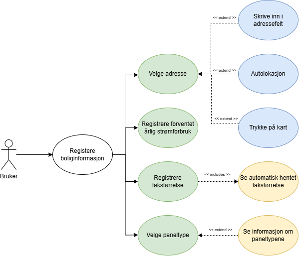
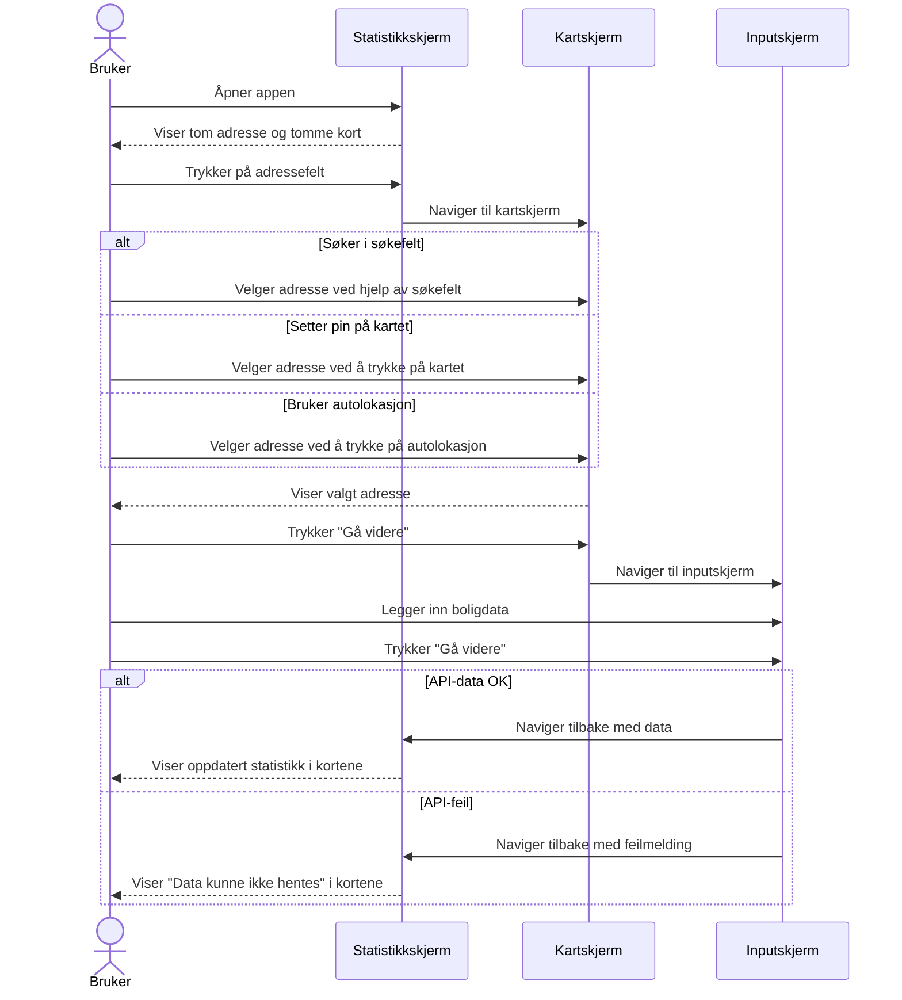
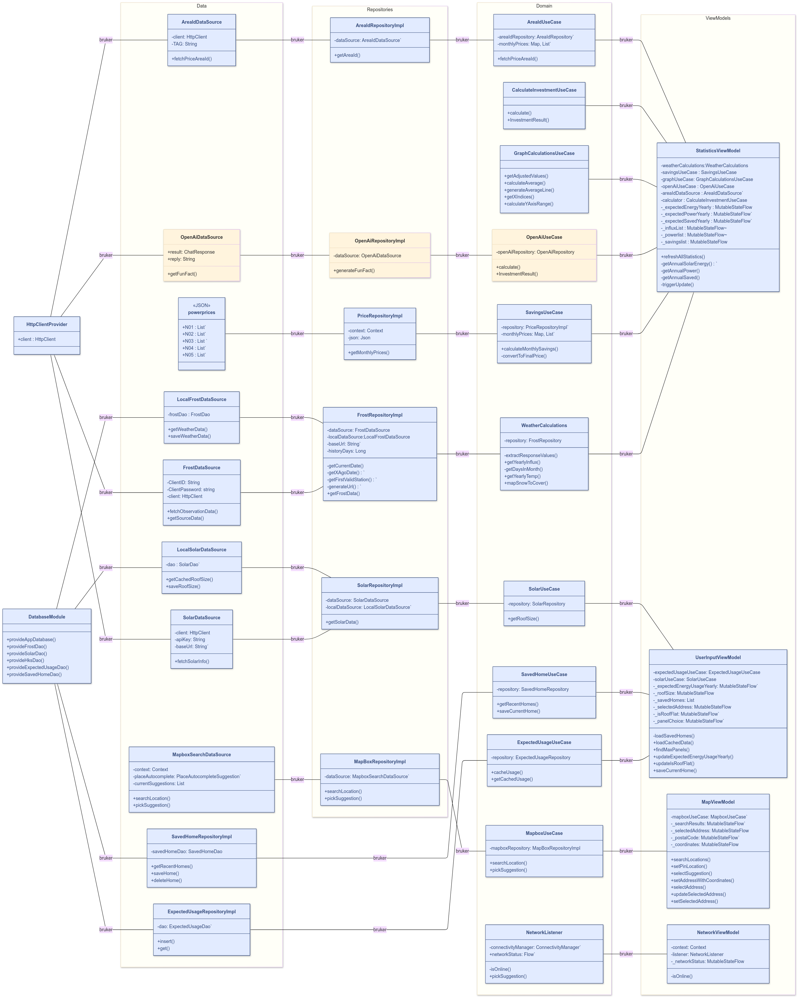
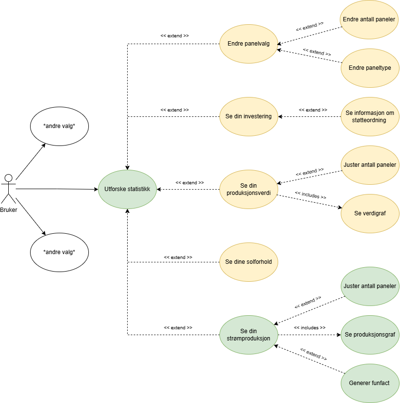
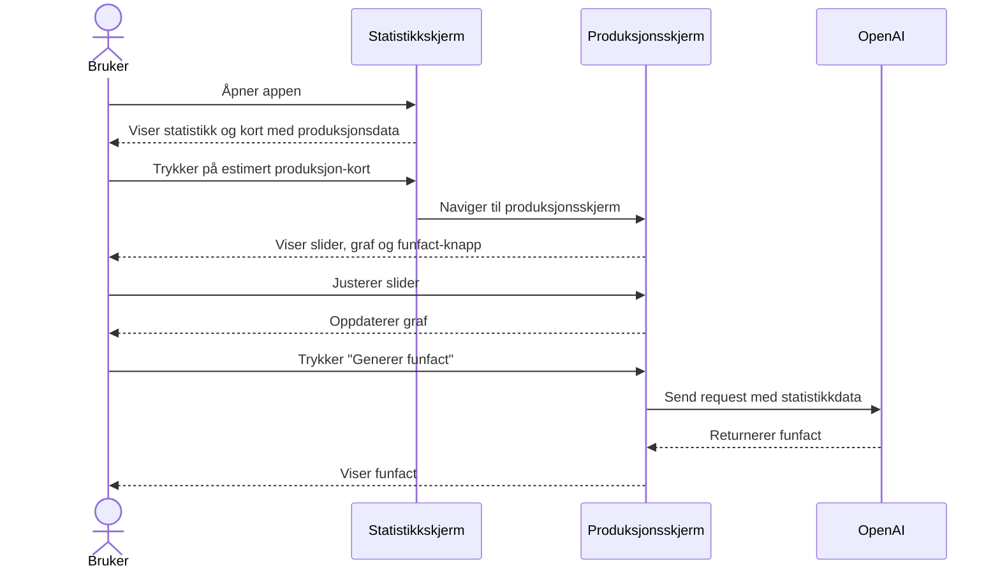
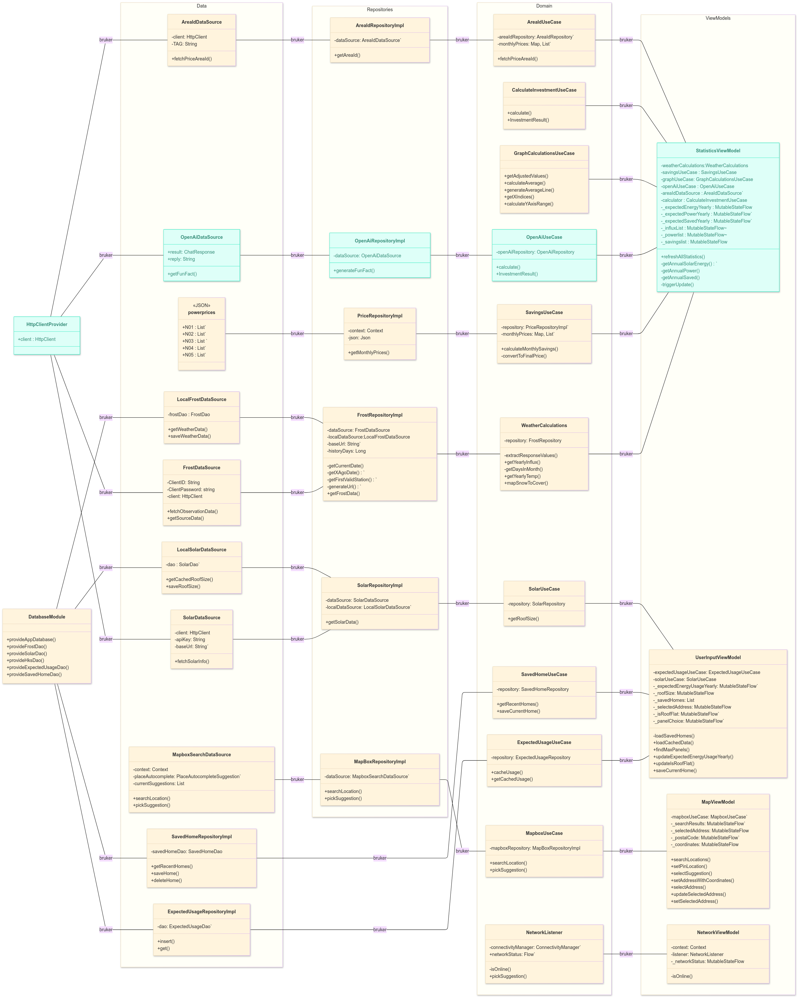
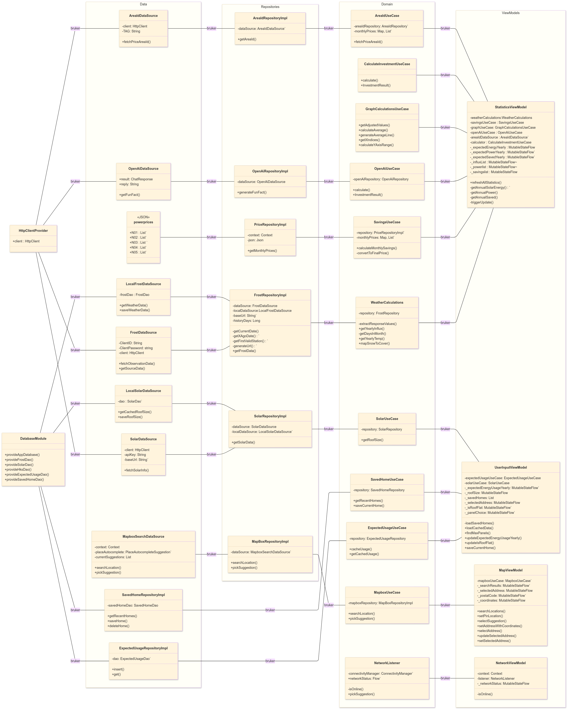

#  MODELING.md
## Valg av diagrammer

For å gi en tydelig beskrivelse av systemets viktigste funksjonaliteter, datastruktur og brukerinteraksjon, har vi laget en rekke UML-diagrammer. 

- **Use-case-diagrammer:** Brukes for å vise hvilke funksjoner systemet tilbyr brukeren, og hvordan brukeren samhandler med systemet. Det tar utgangspunkt i primæraktørens mål og gir et overordnet bilde av systemets funksjonalitet. Dette bidrar til å avklare krav tidlig i prosessen.
- **Sekvensdiagrammer:** Viser interaksjonen og informasjonsflyten mellom aktør og system. Det gir et detaljert innblikk i hvordan samspillet mellom bruker og system foregår over tid. 
- **Klassediagrammer:** Brukes for å modellere datastrukturen i applikasjonen. Diagrammet gir oversikt over objekter, deres egenskaper, relasjoner og metoder, og gir innsikt i database- og kodeimplementasjonen.

Diagrammene skal sammen bidra til et helhetlig bilde av hvordan systemet fungerer både på overflaten og bak kulissene.

---

## Use Case 1: Registrere adresse og boliginfo

**Mål:**  
Brukeren skal kunne registrere en adresse og boligdata for å laste statistikk.

**Aktør:**  
Bruker

**Forutsetning:**
Bruker har ikke registrert noe informasjon

**Trigger:** Brukeren åpner appen og klikker på adressefeltet i statistikkskjermen

### Hovedflyt

1. Brukeren åpner appen og ser statistikkskjerm med tom adresse og tomme kort.
2. Brukeren trykker på adressefeltet.
3. Appen navigerer til kartskjermen.
4. Brukeren velger adresse via søkefelt, kart-pin eller autolokasjon. 
5. Appen viser valgt adresse.
6. Brukeren trykker "Gå videre".
7. Appen navigerer til inputskjermen.
8. Brukeren fyller inn boligdata (takareal, vinkel, paneltype etc.).
9. Brukeren trykker "Gå videre".
10. Appen returnerer til statistikkskjermen og viser detaljert statistikk dersom API-kall var suksessfullt.

### Use-Case diagram
Dette diagrammet viser brukerens ulike handlinger relatert til å registrere adresse og boligdata:

Fargene i diagrammet angir hva brukeren faktisk gjorde (grønn), valgmuligheter (blå), og funksjoner som var tilgjengelige men ikke brukt i denne flyten (gul).

### Sekvensdiagram

Dette sekvensdiagrammet beskriver interaksjonen mellom bruker og appen ved registrering av adresse og boligdata:

### Klassedigram
I dette klassediagrammet er de relevante klasser og deres relasjoner for registrering av boligdata markert i blått. Ettersom dette usecaset beskriver registreringen av en ny adresse er omtrent alle klassene i datastrukturen relevante

---

## Use Case 2: Utforske og tilpasse produksjonstatistikk

**Mål:**  
Brukeren skal kunne justere mengden solcellepanel og motta en funfact basert på hva deres estimerte produksjon kan drive.

**Aktør:**  
Bruker

**Forutsetning:**
Adresse og boligdata er registrert

**Trigger:** Brukeren åpner appen og klikker på produksjonskortet
### Hovedflyt:
1. Brukeren åpner appen og ser statistikkskjerm med ferdig registrert adresse.
2. Brukeren klikker på kortet for estimert produksjon.
3. Appen navigerer til produksjonsskjermen.
4. Produksjonsskjermen viser:
    - En slider for antall paneler
    - En graf over månedlig produksjon
    - En knapp for å generere en funfact

5. Brukeren justerer slideren.
6. Grafen oppdateres dynamisk.
7. Brukeren trykker "Generer funfact".
8. Produksjonsskjermen sender produksjonsdata til OpenAI API.
9. OpenAI returnerer en generert funfact.
10. Produksjonsskjermen viser funfacten til brukeren.
    
### Use-Case diagram

Dette diagrammet viser funksjonene relatert til utforsking av produksjonsstatistikk og brukerinteraksjon:  

De grønne feltene er en del av use-casen. De gule feltene er muligheter brukeren hadde, men ikke tok i bruk i denne flyten

### Sekvensdiagram

Dette sekvensdiagrammet beskriver interaksjonen ved justering av produksjon og henting av funfact:

### Klassedigram

Klassediagrammet viser hvilke klasser som er relevante for visning og justering av produksjonsdata, samt generering av funfacts. Ettersom statistikken allerede er hentet, er det hovedsakelig oppdatering av antall paneler i viewmodel og kall mot OpenAI som er aktuelt.

---

## Også vedlagt:

Det komplette klassediagrammet

