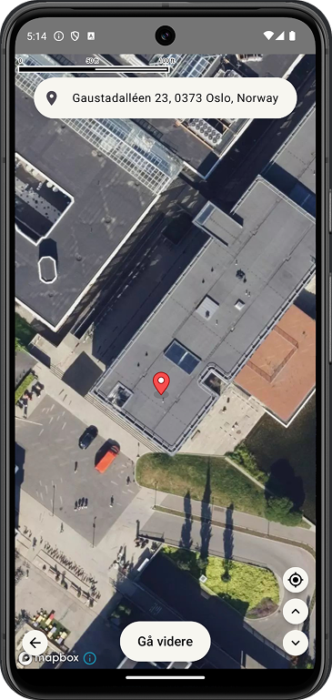
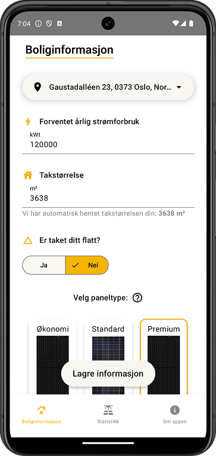
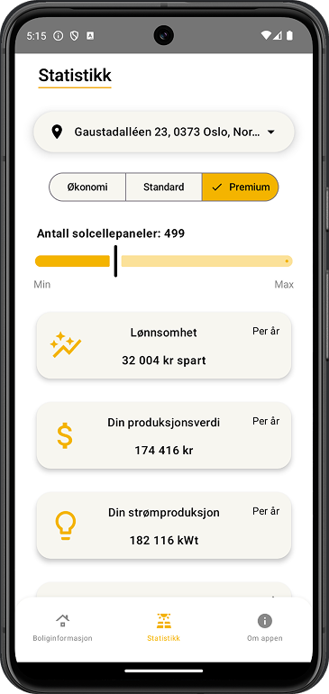
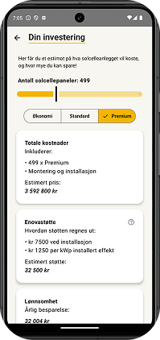
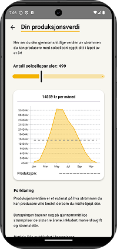
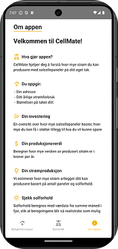
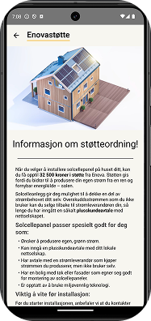
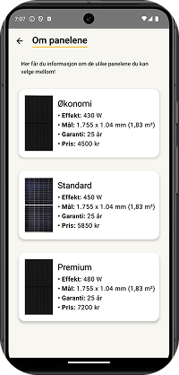

# CellMate

**CellMate** er en Android-app som gjør beregninger for installasjon av solceller enkelt og intuitivt. Det eneste du som bruker trenger å gjøre, er å legge inn adresse, takstørrelse og forventet årlig strømforbruk – så tar vi oss av resten.

Denne appen er utviklet av seks studenter i forbindelse med emnet **IN2000** ved Universitetet i Oslo.

## Hovedfunksjonalitet

- Beregne og vise estimert lønnsomhet, produksjonsverdi, strømproduksjon og solforhold for oppgitt adresse basert på værdata fra Frost.
- Viser addresse i et interaktivt kart (Mapbox). 
- Lagrer en addresse-profil med brukeroppgitt boliginformasjon og relevante værdata. 
- Integrerer ulike API-er for å kunne gi relevant brukerinformasjon og detaljert statistikk.
-  
## 📸 Skjermbilder

| Kart | Brukerinndata | Statistikk |
|------|----------------|------------|
|  |  |  |

| Investering | Verdi | Strøm|
|-------------|-------|---------------|
|  |  |  |

| Informasjon | Enova | Panelvalg |
|-------------|--------|------------|
|  |  |  |
## Hvordan kjøre appen

### Alternativ 1: Du har allerede prosjektmappen lokalt

1. Åpne **Android Studio**.
2. Velg **"Open"** og finn mappen der prosjektet ligger.
3. Når prosjektet er åpnet, trykk på **"Run"** (grønn pil) for å starte appen på en emulator eller tilkoblet enhet.

---

### Alternativ 2: Du må først laste ned prosjektet fra GitHub

   1. Åpne terminalen på din PC eller Mac.
   2. Naviger til området der du ønsker at prosjektet skal ligge.
   3. Gå til GitHub-siden for prosjektet og trykk på **"Code"**-knappen for å kopiere URL-en.
   4. Skriv `git clone <URL>` og lim inn den kopierte URL-en. For eksempel:  
      `git clone https://github.uio.no/IN2000-V25/team-10.git`
   5. Trykk **Enter** og vent til prosjektet er ferdig nedlastet.
   6. Åpne **Android Studio** og velg `Open` fra plasseringen til prosjektet.
   7. Når prosjektet er åpnet, trykk på **"Run"** (grønn pil) for å starte appen på en emulator eller tilkoblet enhet.

## Emulator -og Android Studio innstillinger

### Anbefalt API-nivå

For best mulig ytelse og kompatibilitet under testing anbefales det å bruke **API level 34 (Android 14)** på emulatoren. Applikasjonen fungerer også med **API level 35**, men enkelte visuelle elementer og systemoppførsel kan variere noe mellom versjonene.

For en stabil og forutsigbar opplevelse, anbefaler vi følgende: **Pixel 8 med API level 34 ("UpsideDownCake")**

### Anbefalt miljø for kjøring / videreutvikling av applikasjonen
Applikasjonen er utviklet med Android Studio Meerkat Feature Drop | 2024.3.2.

Vi benytter Android Gradle Plugin (AGP) versjon 8.10.0.

Dersom man får feilmeldinger ved Gradle-sync må man endre AGP nivå i `gradle/libs.versions.toml` filen til riktig for ditt system, dersom Android Studio ikke gjør det automatisk.

### Hvordan bruke autolokasjon i appen

For å få riktig autolokasjon i appen (på emulator) må du manuelt sette en GPS-posisjon i emulatoren:

Slik gjør du det:
1. Start emulatoren i Android Studio.
2. Klikk på ⋮ (Extended controls) i sidepanelet / panelet over emulatoren.
3. Gå til Location-fanen.
4. I “Single points”-fanen:
5. Zoom inn eller søk på ønsket sted på kartet (f.eks. Ole Johan Dahls hus).
6. Koordinatene vil fylles ut automatisk.
7. Klikk på Send for å simulere at enheten er på den lokasjonen.
 
Appen krever at du godkjenner tilgang til lokasjon første gang den starter. Sjekk at dette er tillatt i emulatorens systeminnstillinger hvis du ikke får posisjon.

### Hvordan aktivere norsk tastatur

For å kunne skrive æøå i emulatoren, må du legge til norsk tastatur manuelt:
1. Trykk på "settings" ikonet på tastaturet.
2. Trykk “Languages”, og "Add keyboard".
3. Velg Norsk bokmål(Norge)
4. Trykk pil tilbake til appen.

Du kan nå bytte til norsk tastatur med globe-ikonet (🌐) på tastaturet eller ved å holde inne mellomromstasten.

## Biblioteker

### Coroutines

Coroutines er en del av Kotlin og brukes til å gjøre async-arbeid på en enkel og effektiv måte. De gjør at vi kan hente data i bakgrunnen uten å blokkere hovedtråden, noe som gir en mye bedre brukeropplevelse. Vi bruker coroutines både til API-kall og når vi lagrer data lokalt.

### Dagger Hilt

Dagger Hilt er et verktøy for dependency injection i Android. Det hjelper oss med å holde koden modulær og testbar, og lar oss slippe å manuelt opprette og sende rundt instanser av ulike klasser. Vi bruker Hilt blant annet til å injisere databasen og ulike UseCases i appen. Dette gjør det enklere å skalere etter hvert som prosjektet vokser.

### Gson

Gson er et bibliotek som brukes til å konvertere JSON til Kotlin-objekter og omvendt. Det er nyttig når vi henter data fra API-er og trenger å parse svaret til brukbare datastrukturer. Vi bruker Gson sammen med Room og ved parsing av API-respons.

### Ktor

Ktor er et Kotlin-bibliotek som brukes for å bygge både server- og klientapplikasjoner. Vi bruker det i denne appen for å gjøre HTTP-kall på en ryddig og fleksibel måte. Det passer bra inn i Kotlin-økosystemet og gjør det enkelt å jobbe med async-operasjoner, som for eksempel når vi henter data fra API-er som Frost.

### Mapbox

Mapbox brukes for å vise interaktive kart i appen. Vi bruker det til å vise brukerens adresse og nåværende posisjon. Det er også tilpasset Kotlin og Compose, og gir oss god kontroll over hvordan kartet ser ut og fungerer.

### Room Database

Room er Android sin anbefalte måte å jobbe med lokal lagring. Vi bruker det for å cache værdata, solinformasjon og husprofil, slik at vi fortsatt kan vise info selv om brukeren mister nett. Room lar oss definere entiteter og queries på en enkel og strukturert måte, og fungerer bra sammen med coroutines.

## Personvern

Appen lagrer enkelte data lokalt (værdata, adresseprofil) for å gi en bedre opplevelse. Ingen data deles med tredjeparter. Vi spør om tillatelse til å bruke din eksakte lokasjon.

## Bidragsytere

- Lars Husby Berger – [E-post](mailto:larhbe@uio.no)
- Oskar Halmø – [E-post](mailto:oskarhal@uio.no)
- Martin Wichstrøm Jørgensen – [E-post](mailto:martiwj@uio.no)
- Pia Ottar Karlsen – [E-post](mailto:piaoka@uio.no)
- Henning Osmo Nordhagen – [E-post](mailto:hennion@uio.no)
- Jonas Berger Nyvold – [E-post](mailto:jonasbny@uio.no)
